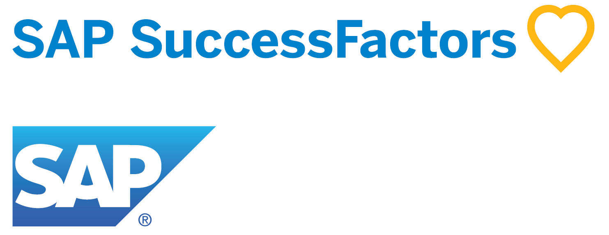
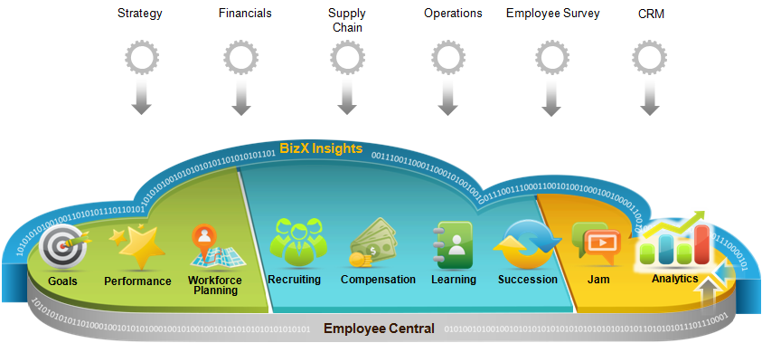

# deepakmalempati.github.io

# About Human Capital Management

Image Source: [Advance systems](https://advancesystems.ie/wp-content/uploads/2017/11/HR-Human-Resources-Management.jpg)

human capital management not only involves in hiring employees, it also manages an employee during his/her time with the company. human capital management helps to equip employees with right talent and support with setting up business process. It majorly focus on hiring, skill development and managing payrolls within the company.

## 1\. About SuccessFactors

Image Source: [SuccessFactors logo](https://cdn.asug.com/uploads/images/SAP_SuccessFactors.png?mtime=20180216024049)

SuccessFactors is SAP's technology tool to identify, select and manage the right talent for a company. it uses innovative businesssolutions to achieve client's business requirement. SuccessFactors started as a company in 1986 and later aquired by SAP. soon after that SuccessFactors migrated to SAP's cloud platform and using the interactive fiora UI design. From many years SuccessFactors is capturing market with major business players implementing successfactors for their companies. This is completely a web based user interface and can be accessed from anywhere.

## 2\. Modules of SuccessFactors

Image Source: [SAP blog](https://blogs.sap.com/wp-content/uploads/2015/02/successfactors_640296.png)

1.  Employee central

*   Successtion

3.  Compensation

*   Variable pay

5.  Recruiting
    *   Recruiting management
    *   Recruiting Marketing
6.  Learning
7.  Onboarding
8.  Performance management and goals management
9.  JAM

## 3\. Benefits of implementing SuccessFactors

*   SAP support through out the usage of product
*   Simplified HR process
*   deep customization
*   SAP's quaterly ugrades
*   interactive fiora user interface

## 4\. References

Refer the documentation to learn more

1.  [Success Factors Implementation guides](https://help.sap.com/viewer/product/SAP_SUCCESSFACTORS_RECRUITING/1905/en-US)
2.  [SAP's Architecture](https://blogs.sap.com)
3.  [Knowledge base](https://support.sap.com/en/my-support/knowledge-base.html)
4.  [SAP learning hub](https://training.sap.com/learninghub)
